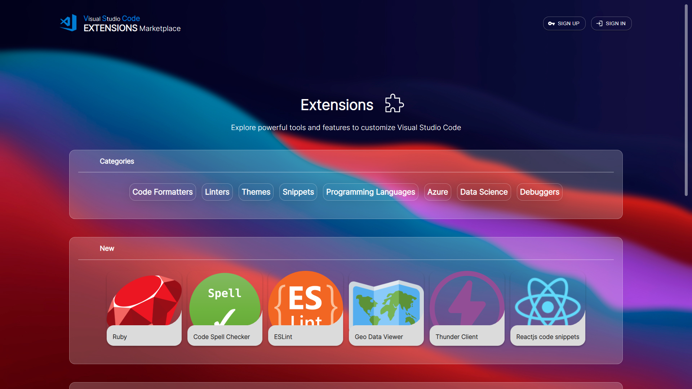
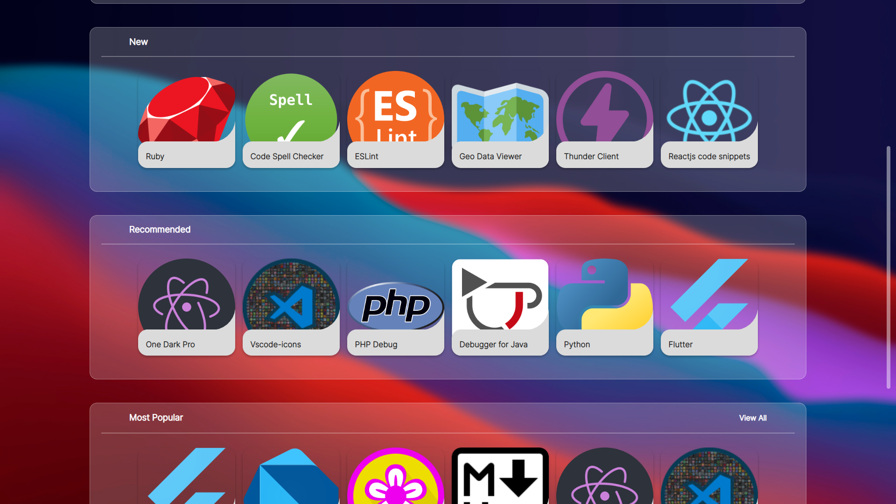
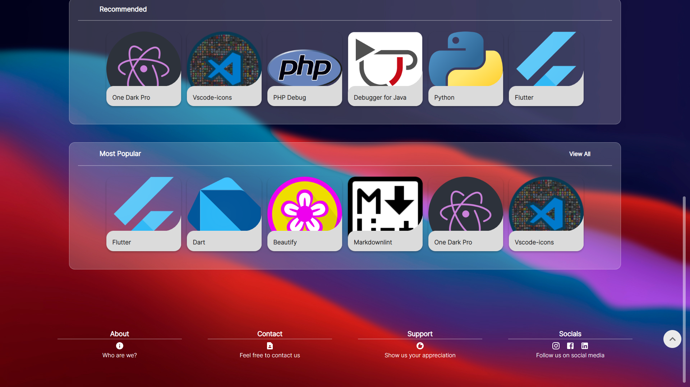
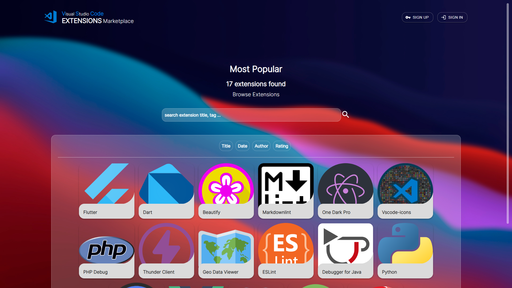
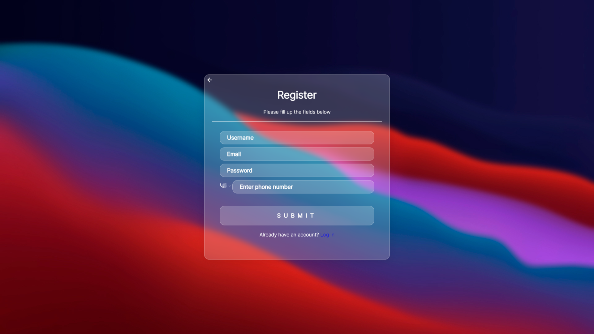
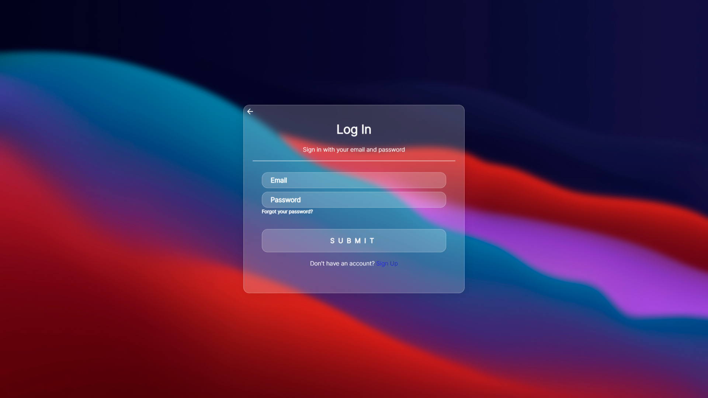
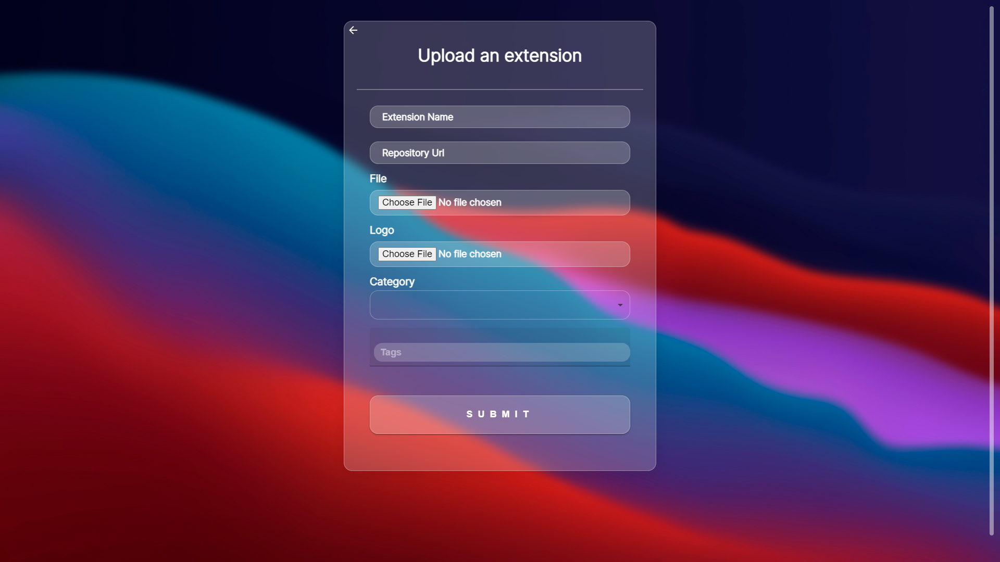
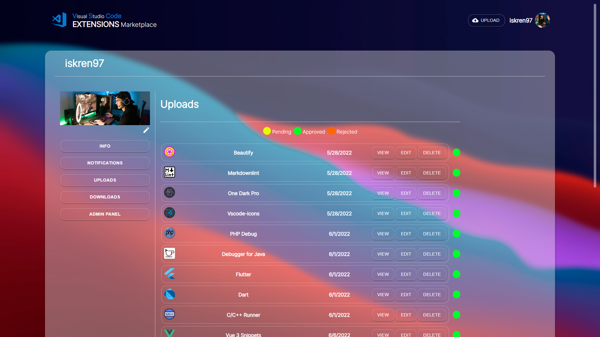
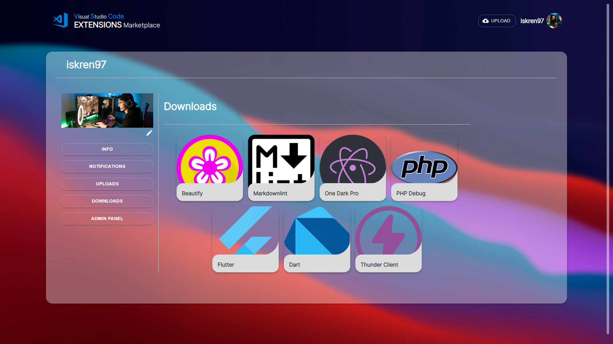

# IDE Addonis Project

The application focus lies on the extensions for VS Code, which means users can post, download, rate their favorite extensions, and more.

In our application, you can find all the information you need when it comes to extensions for VS Code.

For the build we used **React JS**, **HTML** & **CSS**, and some external libraries such as **Material UI**.

There are lots of interesting functionalities and some features, which make our project unique.

### 2. Project information

- Language and version: **JavaScript ES2020**, **React v18.1.0**.
- Database: **Firebase**.

# Addonis

---

Our project has **public** and **private (user)** parts.

The public is accessible for all viewers despite being registered or not.

The private part provides the same as well as all user functionalities, which you do not have when not registered.

---

---

---

---

---

---

---

---

